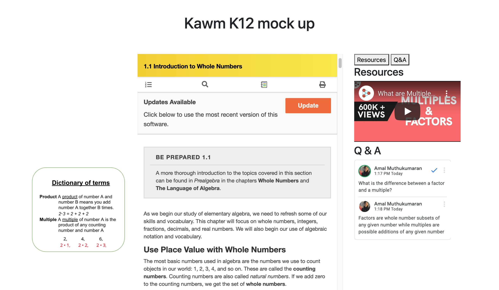

# First prototype

This is a HTML prototoype to give a visual overview of the features I am planning to create

To run, simply open K12_Demo.html 

The 3 features are:
    1. Dictionary of terms
    2. Question and answer 
    3. Media commenting

